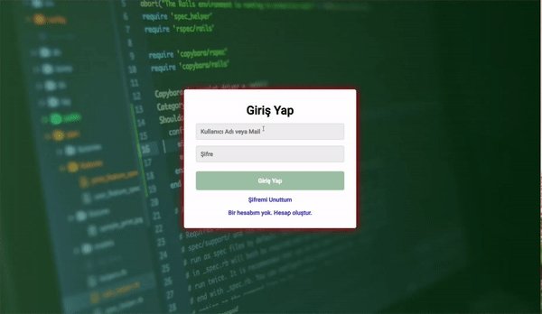

<h1>Giriş Ekranı</h1>

Bu proje, HTML ve CSS kullanılarak oluşturulan basit bir giriş ekranını içerir. Kullanıcılar, kullanıcı adı ve şifrelerini girerek giriş yapabilir yeni bir hesap oluşturabilir veya şifrelerini sıfırlayabilirler.

<h2> Kullanim</h2>
<ul> 
<li>"Kullanıcı Adı veya Mail" ve "Şifre" alanlarına geçerli bilgileri girin.</li>
<li>"Giriş Yap" butonuna tıklayarak giriş yapın.</li>
<li>"Şifremi Unuttum" veya "Bir hesabım yok. Hesap oluştur." bağlantılarına tıklayarak diğer sayfalara geçiş yapabilirsiniz.</li>
<ul>

<h2> Kullanilan Teknolojiler</h2>
<ul> 
<li>HTML</li>
<li>CSS</li>

<ul>

<h2>Ekran Görüntüsü</h2>

